# Project 4 - Eclectic

## Table of Contents

- Project Overview
- Brief
- Technologies Used
- Approach Taken
- Finished Product
- Bugs
- Challenges and Wins
- Future features and improvements
- Key learnings

## Project Overview

Eclectic is an interior’s app where users can browse trending homeware accessories. This is a full-stack application and was my first experience using Django and Python in the back-end. This was an individual project which I built over 8 days.

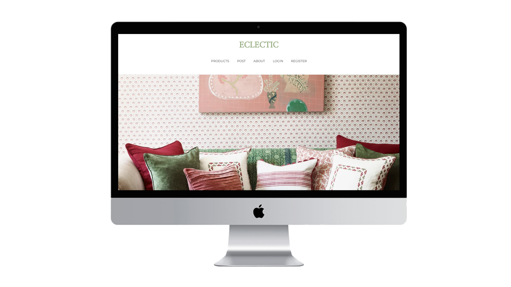

**Find the deployed project here:** https://eclectic-project4.herokuapp.com/

If you wish to login and see the all the features of the app you can use the example details:

**Email:** project-4@example.com
**Password:** example-user

## The Brief

- Build a Full-Stack application with my own front-end and back-end.
- Use a Python Django API using Django REST framework to serve my data from a PostgreSQL database.
- Make requests to your API on a separate front-end built with React.
- Must have CRUD functionality and ideally a situation where a user can login and register an account.
- Detailed wireframes detailing your MVP and stretch goals for the product and have a completed plan of your relationships in the back-end.
- Be successfully deployed online.

## Technologies Used

**_Back-End_**

- Python
- Django
- Django REST framework
- pyJWT
- Psycopg2

**_Front-End_**

- React
- Axios
- SASS
- React Router Dom
- React Bootstrap
- Http-proxy-middleware
- Fa Icons
- React Icons

**_Development Tools_**

- Yarn
- Git
- GitHub
- VScode
- Postman
- Figma
- Asana
- Heroku (deployment)

## Approach Taken

### Day One - Planning:

I knew that I wanted to make an e-commerce style interiors app, as I have a real love for homeware accessories. When planning the project I came up with the idea of Eclectic, which was a library of trending homeware accessories that users could access and be directed to the company’s site if they wanted to buy the product. Users would also be able to have an account and post products they recommend to the rest of the Eclectic community. I also wanted users with accounts to have a wishlist, which they could add their favourite products to. Users would also be able to review and rate different products to help other Eclectic users when deciding on whether to buy the product.

Once I had come up with my idea for the project I began to wireframe what each page would look like and contain, as well as an ERD for my back-end and the relationships each model would have.

**_Wireframes_**

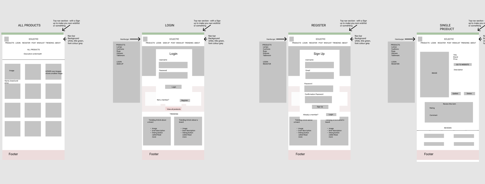

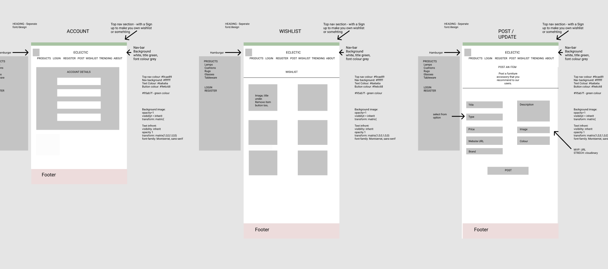

**_Relationships ERD_**

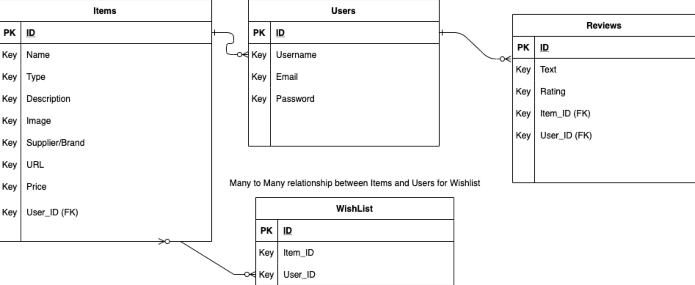

I also decided to use Asana again, after I found it really useful in my previous project to keep track of what tasks I had left to do. I also found it useful highlighting my stretch goals too.

**_Asana Taskboard:_**

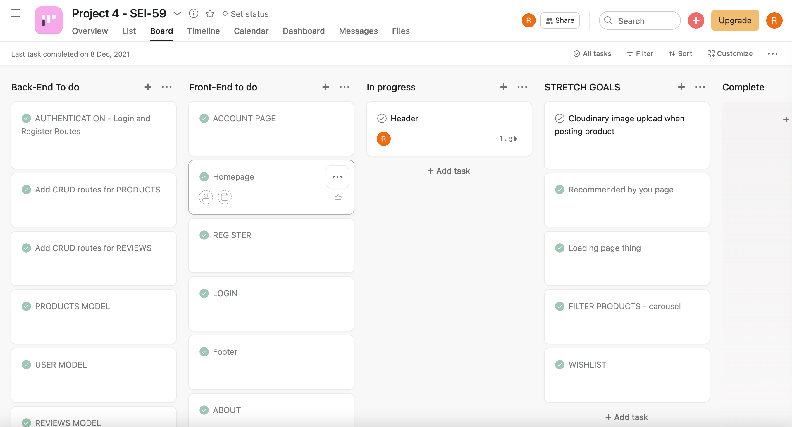

### Day 2 - Building the Back-End:

I spent the whole second day of the project building out the back-end with Python, Django and a Django REST framework to create a PostgreSQL database. I found that Django was a good and straightforward way for creating a PostgreSQL database. I had four models in total, the User model, the Products model, the Articles model and the Reviews model. Once I had built all my models successfully, and included all the relationships I needed - I first tested it out in the admin section that Django provides and when I was happy with the JSON responses I was getting back I tested out all my routes again in Postman. This also made sure that the authentication I had set up was working correctly.

**_Featured Code - Products Views:_**

```

class ProductDetailView(APIView):
    permission_classes = (IsAuthenticatedOrReadOnly, )

    def get(self, request, pk):
        try:
            product = Product.objects.get(id=pk)
            serialized_product = PopulatedProductSerializer(product)
        except:
            return Response(status=status.HTTP_500_INTERNAL_SERVER_ERROR)
        return Response(serialized_product.data, status=status.HTTP_200_OK)

    def delete(self, request, pk):
        try:
            product = Product.objects.get(id=pk)
        except:
            return Response(status=status.HTTP_500_INTERNAL_SERVER_ERROR)
        if product.owner != request.user:
            raise PermissionDenied()
        product.delete()
        return Response(status=status.HTTP_204_NO_CONTENT)

    def put(self, request, pk):
        try:
            product = Product.objects.get(id=pk)
            updated_product = ProductSerializer(
                product, data=request.data, partial=True)
        except:
            return Response(status=status.HTTP_500_INTERNAL_SERVER_ERROR)

        if product.owner != request.user:
            raise PermissionDenied()

        if updated_product.is_valid():
            updated_product.save()
            return Response(updated_product.data, status=status.HTTP_202_ACCEPTED)
        else:
            return Response(updated_product.errors, status=status.HTTP_422_UNPROCESSABLE_ENTITY)

```

### Day 3-7 - Front-End:

After finishing building the back-end, I went and built my React app and began testing out my requests using http-proxy-middleware. Once I successfully began hitting my API correctly I made a start. As I was building the whole app on my own there was a lot of content to create a get through: ie homepage, product list page, single product page, reviews, login and register, post a product, edit a product, delete a product, account page, the wishlist (adding and removing products from a users wishlist), filtering products and related products.

### Product List Page

When I began creating the product index page, I knew that I wanted a few extra features to make it stand out as an ecommerce style application. Once I had displayed all the products neatly on the page, I started adding aspects such as filtering and a hover effect on the images where the user would be able to see a second image. I thought both of these things really added to the slickness of the website.

For the filter I used React bootstrap’s offcanvas feature to appear when a user clicked the filter button and showcase the options the user could select when filtering down products to a specific type i.e. cushion. As each product had a specific type I managed to create separate functions which would filter the array of products according to each type.

**_Featured Code - Filtering:_**

```

 const handleClickCushion = () => {
    const filterProducts = products.filter(p => p.type === 'Cushion')
    setProducts(filterProducts)
    handleClose()
    setIsFilter(true)
  }
  const handleClickLamp = () => {
    const filterProducts = products.filter(p => p.type === 'Lampshade')
    setProducts(filterProducts)
    handleClose()
    setIsFilter(true)
  }
  const handleClickRug = () => {
    const filterProducts = products.filter(p => p.type === 'Rug')
    setProducts(filterProducts)
    handleClose()
    setIsFilter(true)
  }
  const handleClickTable = () => {
    const filterProducts = products.filter(p => p.type === 'Tableware')
    setProducts(filterProducts)
    handleClose()
    setIsFilter(true)
  }
  const handleRemoveFilter = async () => {
    const { data } = await axios.get('api/products/')
    setProducts(data.filter(p => p.owner.id === 1))
    handleClose()
    setIsFilter(false)
  }

```

I also used a state variable, which would be set to true when a user filtered the products, this ensured that the offCanvas would then display an option of removing the filter.

### Single Product

After creating the product index page, I moved onto the single product view page. Here I displayed the product and put the images in a carousel. I thought this was a nice feature to have and added to the ecommerce style I was looking for. I also added a related products section and a section where users could review the product if they wish to do so. I thought the related products section was a nice additional feature, which I did by filtering through the products which were of the same type as that specific product.

I also added the ability for users to edit or delete a product, however, this was based totally on ownership. I felt that by adding the restriction of ownership as to whether a user was given an option to edit or delete a product was a really nice and necessary feature for the app.

**_Featured Code_**

**_Edit and Delete restrictions:_**

```

{userId === ownerId ? (
        <div className='edit-div'>
          <Link to={`/products/${id}/edit`}><button>EDIT</button></Link>
          <button className='delete-button' onClick={handleDelete}>DELETE</button>
        </div>
      ) : (
        <></>
      )}

```

**_Editing a product_**

```

useEffect(() => {
    const getSingleProduct = async (id) => {
      const { name, type, description, imageOne, imageTwo, brand, url, price, colour } = (await axios.get(`/api/products/${id}/`)).data
      setData({ name, type, description, imageOne, imageTwo, brand, url, price, colour })
    }
    getSingleProduct(id)
  }, [id])

  const handleSubmit = async (event) => {
    event.preventDefault()

    const config = {
      method: 'put',
      url: `/api/products/${id}/`,
      headers: {
        'Authorization': `Bearer ${getToken()}`,
        'Content-Type': 'application/json',
      },
      data,
    }

    try {
      const response = await axios(config)
      console.log(response.data)
      navigate(`/products/${response.data.id}`)
      setIsError(false)

    } catch (err) {
      console.error(err)
      setIsError(true)

    }
  }
  const handleFormChange = (event) => {
    const { name, value } = event.target
    setData({
      ...data,
      [name]: value,
    })
  }

```

### Wishlist

When creating the wishlist functionality it wasn’t too technical as I successfully created some routes in my back-end which added and deleted items into a users wishlist. I started by adding the functionality of adding to a wishlist on the single product pages - all I needed to do was create a button which when clicked would send a post request to the backend requesting to add the particular product to the user’s wishlist.

After I had finished this I just had to add the functionality for a user to remove a product from their wishlist. Again because I created a route to handle this in the backend, all I had to do was send a ‘put’ request to update and delete the product from the user’s wishlist. I felt that having the wishlist was a really nice feature for the website and I used react bootstrap cards as a styling feature which made it look really professional.

**_Featured Code_**

**_Adding back-end functionality_**

```
  def post(self, request, pk):
        try:
            product = Product.objects.get(id=pk)
            user = request.user
            user.wish_list.add(product)
            new_list = PopulatedUserSerializer(user)
        except:
            return Response(status=status.HTTP_401_UNAUTHORIZED)
        return Response(new_list.data, status=status.HTTP_200_OK)

```

**_Removing from the wishlist_**

```
const WishList = ({ setAccount, name, brand, imageOne, price, id }) => {

  const handleRemove = async () => {
    const config = {
      method: 'put',
      url: `/api/auth/${id}/`,
      headers: {
        'Authorization': `Bearer ${getToken()}`,
      },
    }
    const { data } = await axios(config)
    setAccount(data)
  }

  return (
    <Card style={{ width: '18rem' }}>
      <Link to={`/products/${id}`}><Card.Img variant='top' src={imageOne} /></Link>
      <Card.Body>
        <Card.Title>{name}</Card.Title>
        <Card.Text>{brand}</Card.Text>
        <Card.Text>{`£${price}`}</Card.Text>
        <button className='remove-button' onClick={handleRemove} >REMOVE</button>
      </Card.Body>
    </Card>
  )
}

```

### Day 8 - Finishing styling additions:

On the final day left I spent it adding additional styling features, such as response mobile design. I felt this really added to the slickness of the app. I also went through and tidied up my code by removing console logs and comments.

## Finished Product

**Home Page**


**Product Index Page**

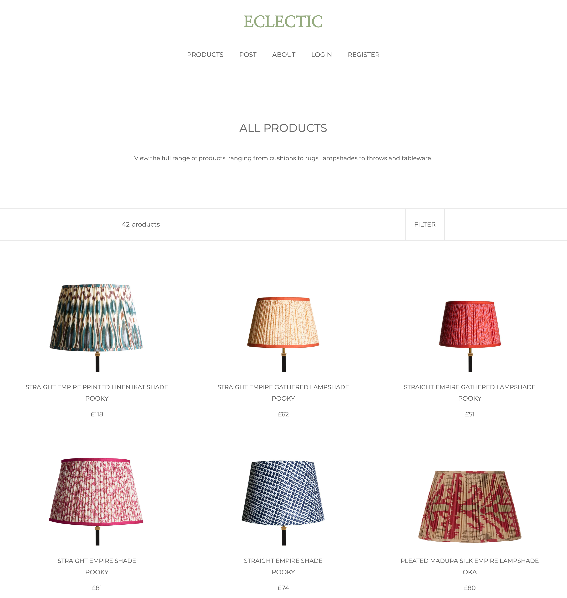

**Single Product Page**

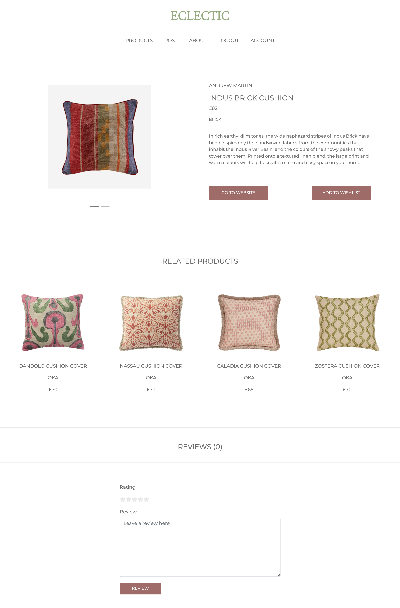

**Reviews**

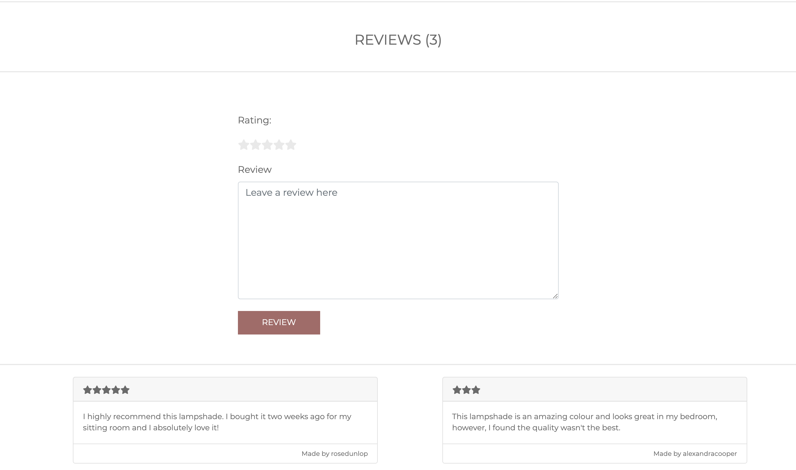

**Edit and Delete Product Options**

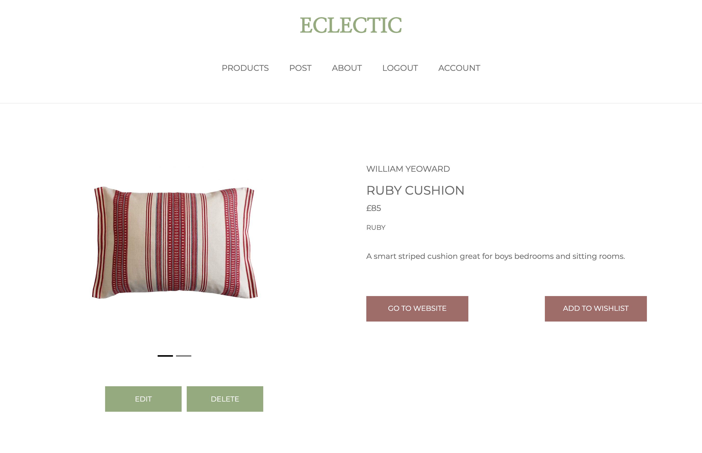

**Edit and Post Product Forms**

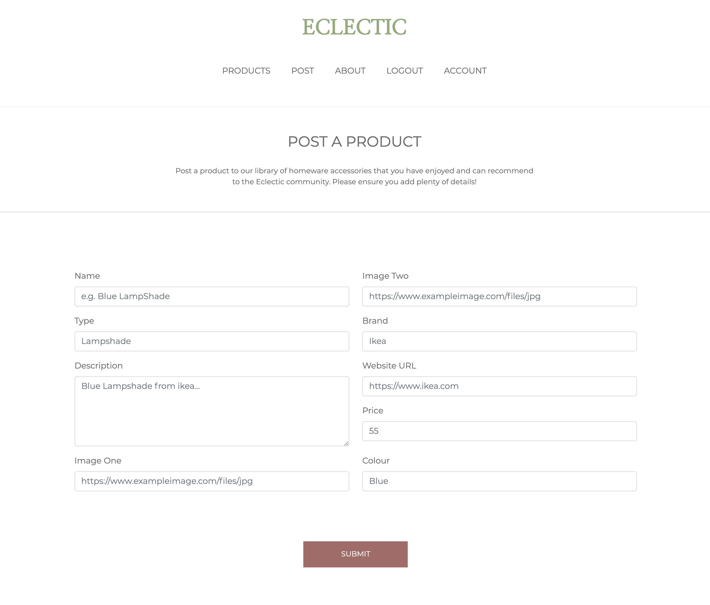

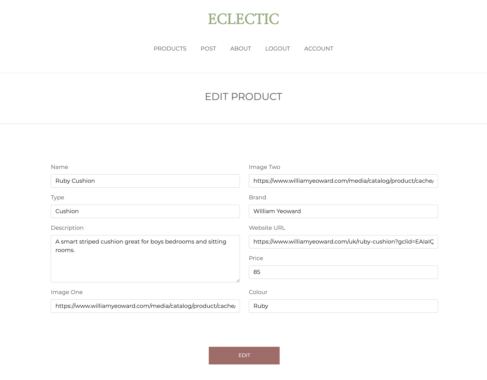

**Account and Wish List**

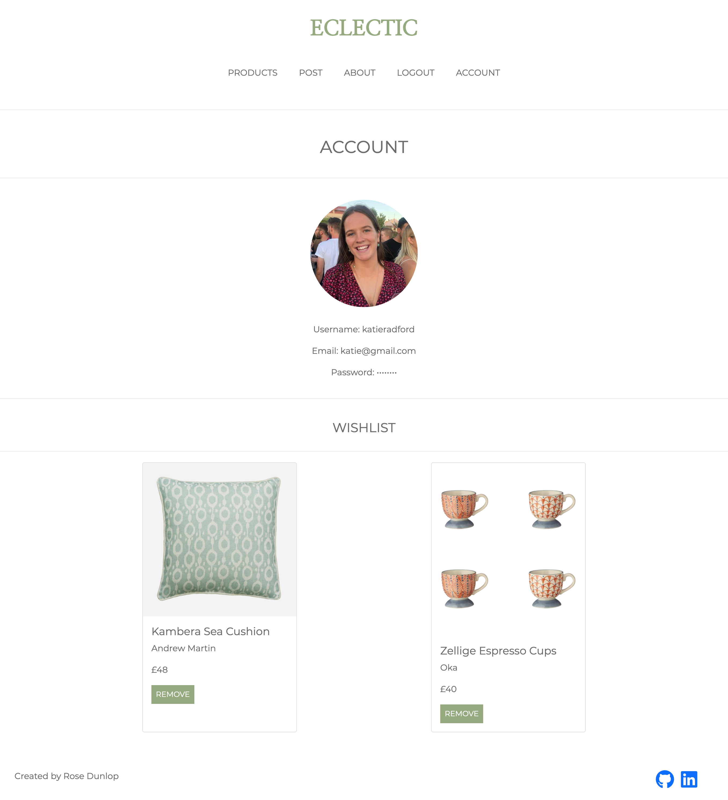

**Register and Login**

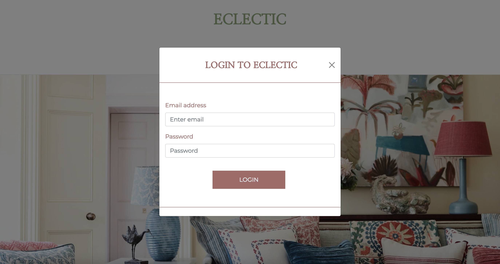

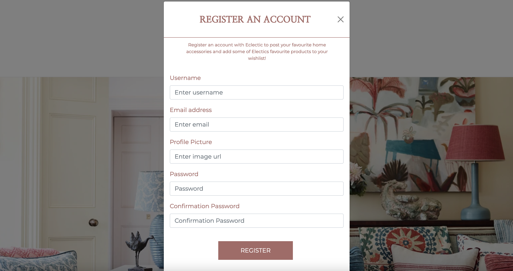

## Wins and Challenges

**_Wins_**

- I was seriously happy with the overall design and responsiveness of the app. I felt it looked really professional which was my main aim and I also found I managed to create an app that lacked bugs and has great functionality throughout.
- I was also particularly happy with the amount I managed to do in such a short amount of time, particularly because it was an individual project.

**_Challenges_**

- I found using Django in the back-end challenging at times. It took me a long time to figure out how to use a many to many relationship with a custom user model for the wish list. However, after reading the documentation thoroughly I managed to get past this and it really made my life easy when displaying and creating the functionality later on in the front-end.

## Bugs

- After adding an item to a wishlist the button changes on the product page. However, after the page reloads the state reverts. Meaning when a product is already added to your wishlist it sometimes isn’t always clear on the single product page.

## Future Content and Improvements

- There were two stretch goals that I didn’t have time to implement: a search bar and having a cloudinary image upload.

## Key Learnings

- My key takeaway from this project was gaining a better understanding of Python and Django. While I found using django challenging at points, I found I really started to get to grips with it by the end of this project and will definitely push to use it more in the future.
